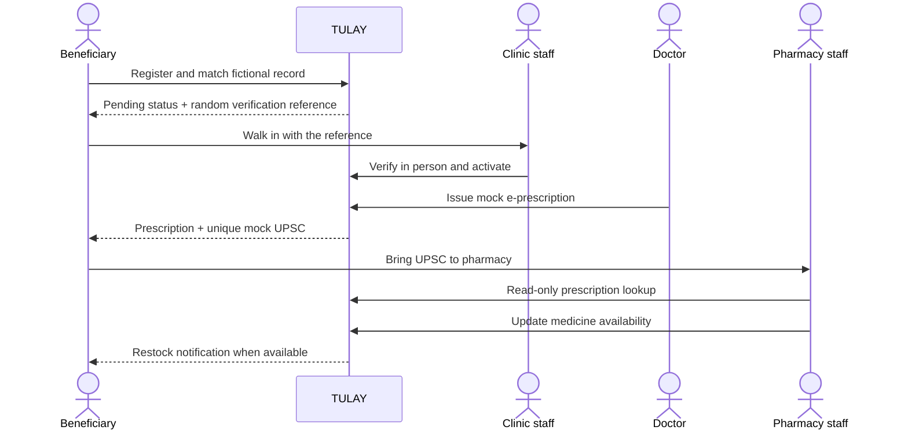
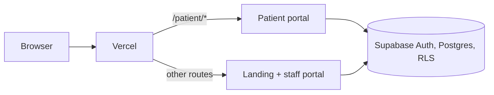

<p align="center">
  
</p>

<h1 align="center">TULAY</h1>

<p align="center">
  <strong>From PhilHealth medicine coverage to medicine in hand.</strong>
</p>

<p align="center">
  A mobile-first healthcare-access prototype for connecting beneficiaries, clinics, doctors, and pharmacies in one guided journey.
</p>

> [!IMPORTANT]
> TULAY is a hackathon prototype. All patients, clinics, pharmacies, prescriptions, and codes in this repository are fictional. TULAY is not affiliated with, connected to, or an official replacement for PhilHealth, YAKAP, or GAMOT systems.

## The idea in one minute

TULAY (Filipino for “bridge”) helps a beneficiary answer three practical questions:

1. **Can I start the process, and which clinic should I go to?**
2. **What do I need to do before I can receive a prescription?**
3. **Where can I bring my prescription, and is the medicine available?**

It turns a fragmented process into a traceable handoff:

```text
Beneficiary registration
        ↓
Mock registry match + clinic selection
        ↓
Pending in-person verification at the assigned clinic
        ↓
Clinic staff activation
        ↓
Doctor-issued e-prescription with a mock UPSC
        ↓
Pharmacy lookup + medicine availability
        ↓
Restock notification when a subscribed medicine becomes available
```

The important trust boundary is intentional: **a registry match does not activate an account**. The beneficiary must still visit the assigned clinic, show the verification reference, and be approved by assigned clinic staff in person.

## Why this problem matters

PhilHealth's GAMOT (Guaranteed and Accessible Medications for Outpatient Treatment) benefit is designed to help members access outpatient medicines. PhilHealth describes coverage of up to **₱20,000 per year**, including **21 essential medicines through YAKAP clinics** and **54 additional medicines through partner pharmacies** ([PhilHealth](https://www.philhealth.gov.ph/news/up/article/2026/news_6a2634094e2bd.php)).

The benefit can still be difficult to navigate when registration, clinic verification, prescribing, and pharmacy availability are disconnected. PhilHealth has also acknowledged access and provider-readiness issues in its [2026 advisory on GAMOT implementation](https://www.philhealth.gov.ph/advisories/2026/PA2026-0017.pdf).

TULAY focuses on the coordination problem around the benefit. It does not attempt to replace official eligibility, prescribing, accreditation, or dispensing systems.

## What TULAY demonstrates

| Person | What they can do in the prototype |
| --- | --- |
| **Beneficiary** | Register, match a fictional PhilHealth record, confirm or select a demo clinic, view activation status, see prescriptions, find care, check medicine availability, and receive restock notices. |
| **Clinic staff** | Look up a pending beneficiary using a random verification reference, verify the person in the clinic, and explicitly activate the account. |
| **Doctor** | View active beneficiaries assigned to the doctor’s clinic and issue a structured mock e-prescription. |
| **Pharmacy staff** | Look up a prescription using its exact mock UPSC and report a medicine as **Available** or **Out of Stock**. |

## The judge’s demo path

The shortest way to understand TULAY is to follow one beneficiary from pending registration to medicine access.

### 1. Start with an active beneficiary

Open the patient portal at `/patient` and use the active beneficiary account. This shows the patient-facing outcome: care directory, prescriptions, medicine availability, and notifications.

### 2. Show the clinic verification boundary

Use the pending beneficiary account to show that a matched record is not yet active. The patient sees the assigned clinic and verification reference, but cannot open protected prescription or medicine features.

Then open the staff portal at `/login`, enter the verification reference as assigned clinic staff, and approve activation. The approving staff member and activation time are recorded.

### 3. Issue the prescription

Sign in as the assigned doctor, open the now-active patient, and issue a mock e-prescription. TULAY generates a unique mock **UPSC** (Unique Prescription Security Code) in the backend; the patient cannot choose or edit it.

### 4. Complete the pharmacy handoff

Sign in as pharmacy staff and enter the exact UPSC. The lookup returns only the information needed for the transaction. It is read-only: entering the code does not consume it and does not automatically authorize dispensing.

### 5. Demonstrate availability awareness

Update a medicine from **Out of Stock** to **Available**. A subscribed beneficiary receives one in-app notification and one clearly labeled simulated SMS notification. Saving **Available** again does not create a duplicate alert.



## Demo accounts and fictional test data

These accounts are for this prototype only. The shared demo password is **`12345678`**. Do not use it for any real account or real patient information.

<details>
<summary>Show demo accounts</summary>

| Role | Login email | Use this account to demonstrate |
| --- | --- | --- |
| Beneficiary | `eunicekatebelasa1313@tulay.demo` | Active patient view, prescriptions, care directory, medicine availability, and notifications |
| Beneficiary | `gayemmartin@tulay.demo` | Pending patient view and protected-feature lock |
| Clinic staff | `clinicstaff@tulay.demo` | Pending-beneficiary lookup and clinic activation |
| Doctor | `doctor@tulay.demo` | Issue an e-prescription for an active patient in the assigned clinic |
| Pharmacy staff | `pharmacystaff@tulay.demo` | UPSC lookup and medicine availability reporting |

Use `/patient/login` for beneficiary accounts and `/login` for clinic, doctor, and pharmacy accounts.

</details>

<details>
<summary>Show onboarding fixtures</summary>

Enter these values in the beneficiary’s fictional PhilHealth-information form. Matching is exact after normalizing capitalization and whitespace.

| Mock PhilHealth ID | First name | Last name | Birth date | Expected path |
| --- | --- | --- | --- | --- |
| `DEMO-PH-001` | `Eunice` | `Belasa` | `2000-01-15` | New enrollee: choose a nearby demo YAKAP clinic, then remain Pending until clinic activation |
| `DEMO-PH-002` | `Sample` | `Beneficiary Two` | `1995-06-20` | Existing member: confirm the assigned Demo Bayanihan YAKAP Clinic, then remain Pending until clinic activation |

`DEMO-PH-001` is already linked to the active demo beneficiary account. For a fresh match test, use `DEMO-PH-002` with an account that has not claimed that record.

The new-enrollee 15 km clinic-distance check is a TULAY demo rule. Browser location is used transiently for that check and is not stored.

</details>

## What is live, simulated, and intentionally limited

The prototype is deliberately honest about what it proves.

### Connected to Supabase and ready to demonstrate

- Authenticated beneficiary, clinic staff, doctor, and pharmacy accounts
- Fictional registry matching with duplicate-record protection
- New-enrollee clinic selection and existing-member clinic confirmation
- Pending account lock until assigned clinic staff explicitly activate the account
- Clinic activation audit with approving staff and timestamp
- Doctor-issued mock prescriptions for active patients assigned to that clinic
- Backend-generated unique mock UPSCs
- Exact-code pharmacy lookup with no automatic consumption or dispensing
- Facility directory, medicine availability, and last-updated status
- Restock alert transition with duplicate prevention
- Server-side role and organization checks plus Supabase Row Level Security

### Simulated or not wired yet

- Patient appointment/book, benefit-balance, referral-preview, map, walk-in-plan, and request-note screens use fictional fixture data.
- The patient restock/SMS subscription toggle is visual only; the alert trigger is connected, but subscriptions are not yet created from that UI.
- The medicine checker is a labeled mock formulary, not a live official eligibility or inventory query.
- Appointment, time-slot, and referral staff screens do not store operational data.
- SMS is simulated; no real message is sent.
- Activation denial, profile editing, and password-change flows are not available in this prototype.

## Safety, privacy, and scope

TULAY is a coordination prototype, not a medical or government system.

- All records and facilities are fictional demo data. No real patient data belongs in this repository.
- The private mock registry is not exposed to the browser or directly queryable by ordinary users.
- Roles, activation status, and clinic/pharmacy assignments are stored server-side. The app does not authorize users from editable client metadata.
- A clinic staff member can activate only a pending beneficiary assigned to that clinic.
- A doctor can prescribe only for an active beneficiary assigned to that doctor’s clinic.
- Pharmacy staff can perform a narrow exact-UPSC lookup and update their own facility’s availability; they cannot activate accounts or prescribe.
- Verification references and UPSCs are randomly generated references, not identity documents or official PhilHealth/GAMOT codes.
- The prototype does not diagnose, verify provider accreditation, process payments or reimbursement, track exact inventory, track dispensed or remaining quantities, generate automatic dispensing slips, or integrate with official PhilHealth/GAMOT systems.

## Technical overview

| Layer | Technology |
| --- | --- |
| Frontend | Next.js App Router, React, TypeScript, Tailwind CSS |
| Data and auth | Supabase Auth, Postgres, Row Level Security, database triggers and RPCs |
| Server integration | Next.js Server Actions with server-side Supabase clients |
| Hosting | Vercel |
| Responsive target | Mobile-first layout that also supports tablet and desktop workflows |

The deployed experience uses two Next.js applications behind one domain:



`vercel.json` routes `/patient/*` to `patient_mobile/` and all other routes to the landing page and staff portal in `src/`. Sensitive operations are checked in server actions and again by protected database operations.

## Repository layout

| Path | Purpose |
| --- | --- |
| `src/` | Landing page and staff portal for clinic staff, doctors, and pharmacy staff |
| `patient_mobile/` | Patient portal served at `/patient` |
| `patient_web/` | Earlier patient web scaffold; not deployed |
| `supabase/migrations/` | Versioned schema, RLS policies, restricted operations, and triggers |
| `supabase/seed.sql` | Fictional clinics, pharmacy, medicine categories, and registry records |
| `docs/` | Scope decisions, API contracts, responsive rules, and backend status |
| `tests/acceptance.md` | Manual role, security, and responsive acceptance checklist |
| `vercel.json` | Production routing between the two applications |

## Run the demo locally

You need Node.js 20.9+ and a Supabase project.

1. Install dependencies for both applications:

   ```bash
   npm install
   npm --prefix patient_mobile install
   ```

2. Copy the environment template and set `NEXT_PUBLIC_SUPABASE_URL` and `NEXT_PUBLIC_SUPABASE_PUBLISHABLE_KEY`:

   ```bash
   # Windows PowerShell
   Copy-Item .env.example .env.local
   ```

3. Apply the files in `supabase/migrations/` in filename order, then run `supabase/seed.sql` in the Supabase SQL Editor or with `psql`. The seed creates two fictional YAKAP clinics, one fictional GAMOT partner pharmacy, 75 medicine categories, and two fictional registry records.

4. Create provider users in Supabase Auth and assign their trusted role and facility in the SQL Editor. Provider accounts are not created by public signup.

5. Start both portals in separate terminals:

   ```bash
   npm run dev           # landing + staff portal on http://localhost:3000
   npm run dev:patient   # patient portal on http://localhost:3100
   ```

   In development, open `http://localhost:3000`; `/patient` is proxied to the patient app. On a deployed site, use the same `/patient` and `/login` paths after the domain name.

For the new-enrollee path, the browser must be within 15 km of a fictional demo clinic in Manila or Quezon City. For a simpler test, use the existing-member fixture or set a test location with browser developer tools.

### Useful commands

| Command | Purpose |
| --- | --- |
| `npm run dev` | Start the landing and staff portal |
| `npm run dev:patient` | Start the patient portal |
| `npm run build` | Build the staff portal |
| `npm run typecheck` | Run the root TypeScript check |
| `npm run lint` | Run the root Biome lint |
| `npm --prefix patient_mobile run build` | Build the patient portal |
| `npm --prefix patient_mobile run typecheck` | Type-check the patient portal |

## Verification status

The backend setup has been verified against the team’s Supabase project for:

- fictional registry match → Pending → clinic activation with an audit record;
- doctor issuance → unique mock UPSC → reusable pharmacy lookup;
- Out of Stock → Available notification with no duplicate on repeated saves; and
- the 15 km new-enrollee clinic rule.

The complete negative-role checklist, integrated phone/tablet/desktop review, and deployed-device testing still need to be completed. See [docs/backend-setup-status.md](docs/backend-setup-status.md) and [tests/acceptance.md](tests/acceptance.md) for the exact status.

## Team

| Member | Focus |
| --- | --- |
| Eunice | Project lead, scope, and patient portal integration |
| Martin | Backend, database, and Supabase |
| Dan | Frontend pages and responsive design |
| JJ | Provider and demo data, documentation, and testing |

## Further reading

- [docs/project-inputs.md](docs/project-inputs.md) — team decisions and fictional demo data
- [docs/api-contracts.md](docs/api-contracts.md) — protected operations and authorized roles
- [docs/backend-setup-status.md](docs/backend-setup-status.md) — deployed and verified backend work
- [docs/responsive-design.md](docs/responsive-design.md) — mobile-first layout rules
- [tests/acceptance.md](tests/acceptance.md) — manual acceptance checklist
